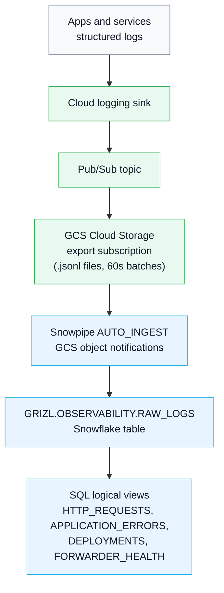
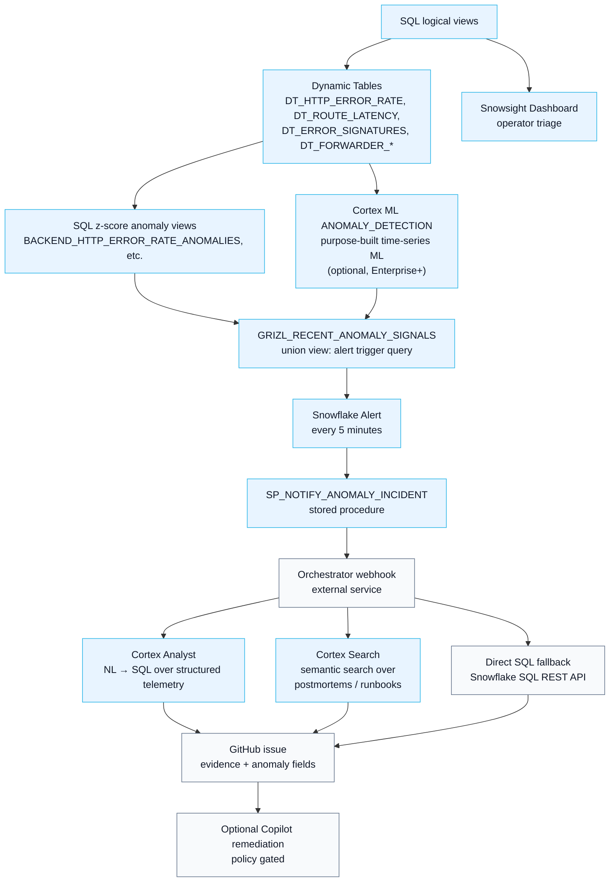

# GRIZL Snowflake Observability

Public, sanitized Snowflake observability package for building an agentic incident-evidence loop on top of structured application telemetry.

This repo packages the Snowflake side of the GRIZL observability architecture: Snowpipe AUTO_INGEST from GCS, SQL logical views, Dynamic Tables for materialized baselines, Snowflake Alerts, Cortex ML ANOMALY_DETECTION, and Cortex Agents (Analyst + Search) for natural-language incident evidence retrieval. It is designed to pair with an external application/orchestrator service that receives Snowflake Alert webhooks, asks Cortex Agents for evidence, creates GitHub issues, and assigns GitHub Copilot Coding Agent only when remediation is safe, scoped, and code-actionable.

This is the third platform in the GRIZL observability series:
- [grizl-fabric-observability](https://github.com/Metafiziks/grizl-fabric-observability) — Microsoft Fabric (Eventhouse, KQL, Activator, Fabric Data Agent)
- [grizl-databricks-observability](https://github.com/Metafiziks/grizl-databricks-observability) — Databricks (Delta Lake, SQL z-scores, Workflow, Genie)
- **grizl-snowflake-observability** — Snowflake (Snowpipe, Dynamic Tables, Cortex ML, Cortex Agents)

```text
Application + frontend + deployment + forwarder telemetry
  -> cloud logging sink / Pub/Sub
  -> GCS Cloud Storage export subscription (reuses grizl-databricks-observability bucket)
  -> Snowpipe AUTO_INGEST
  -> GRIZL.OBSERVABILITY.RAW_LOGS
  -> SQL logical views + Dynamic Tables
  -> Cortex ML ANOMALY_DETECTION (or SQL z-score fallback)
  -> GRIZL_RECENT_ANOMALY_SIGNALS
  -> Snowflake Alert (every 5 minutes)
  -> stored procedure -> orchestrator webhook
  -> Cortex Agent evidence (Cortex Analyst SQL + Cortex Search postmortems)
  -> GitHub issue + optional Copilot Coding Agent handoff
```

| Path | Purpose |
|---|---|
| `sql/` | Snowflake DDL, logical views, Dynamic Tables, anomaly signal views, Cortex ML procedures, Alerts, and dashboard tile queries |
| `snowflake/` | Snowflake CLI provisioning scripts, config templates, manifests, and dry-run-safe helpers |
| `docs/snowflake-incident-orchestrator.md` | Reference architecture: Alert webhook payload, Cortex Agent API calls, GitHub issue format, Copilot assignment policy |

No Snowflake account identifiers, private keys, GCS bucket names, webhook URLs, GitHub tokens, or live project IDs are included. Replace placeholder values such as `<SNOWFLAKE_ACCOUNT>`, `<GCS_LOGS_BUCKET>`, and `your-orchestrator.example.com` with values from your own environment.

## Architecture

### Telemetry path



### Detection, evidence, and response path



## What is included

The SQL artifacts assume a `RAW_LOGS` Snowflake table populated from Pub/Sub → GCS → Snowpipe. The package provides:

- **Snowpipe setup**: `GRIZL_GCS_INTEGRATION` storage integration, `GCS_LOGS_STAGE`, `RAW_LOGS_PIPE` AUTO_INGEST
- **SQL logical views**: `HTTP_REQUESTS`, `APPLICATION_ERRORS`, `FRONTEND_TELEMETRY`, `DEPLOYMENTS`, `FORWARDER_HEALTH`
- **Dynamic Tables**: `DT_HTTP_ERROR_RATE`, `DT_ROUTE_LATENCY`, `DT_ERROR_SIGNATURES`, `DT_FORWARDER_FRESHNESS`, `DT_FORWARDER_DROPS`, `DT_DEPLOYMENT_ERROR_RATE` — materialized, auto-refreshing baselines with 5-minute TARGET_LAG
- **SQL z-score anomaly signal views**: six signal views + `GRIZL_RECENT_ANOMALY_SIGNALS` UNION view — works immediately, no model training required
- **Cortex ML ANOMALY_DETECTION**: optional upgrade path; trained models for error rate and latency once 2+ days of data accumulate (Enterprise+ only)
- **Cortex Search Service**: `GRIZL.KNOWLEDGE.ARTICLE_SEARCH_SVC` — semantic search over `GRIZL.KNOWLEDGE.ARTICLES` (postmortems, runbooks)
- **Cortex Agent configuration**: `cortex-agent-config.example.json` + `cortex-analyst-semantic-model.example.yaml` — defines the Analyst + Search tool pair for incident evidence
- **Snowflake Alerts**: `GRIZL_ANOMALY_ALERT` (5-min, fires `SP_NOTIFY_ANOMALY_INCIDENT`) + supplementary email/text alerts
- **Snowsight dashboard tile queries** for operational triage
- **Provisioning scripts** (`provision.sh`, `teardown.sh`, `snowpipe-mgmt.sh`, `cortex-agent-mgmt.sh`), dry-run mode, config templates

The anomaly-signal layer covers the same high-value signals as the Fabric and Databricks versions:

| View | Signal |
|---|---|
| `BACKEND_HTTP_ERROR_RATE_ANOMALIES` | backend 5xx/error-rate anomalies by service and route |
| `ROUTE_LATENCY_ANOMALIES` | route p95 latency anomalies |
| `ERROR_SIGNATURE_SPIKE_ANOMALIES` | application error-signature spikes |
| `FORWARDER_FRESHNESS_DROP_ANOMALIES` | forwarder healthy-event volume drops |
| `FORWARDER_DROP_FAILURE_ANOMALIES` | forwarder skip/failure spikes |
| `POST_DEPLOYMENT_REGRESSION_ANOMALIES` | post-deployment error-rate regressions by deployment SHA |
| `GRIZL_RECENT_ANOMALY_SIGNALS` | UNION view — the Snowflake Alert trigger query |

## Snowflake vs Fabric substitutions

The companion repo [grizl-fabric-observability](https://github.com/Metafiziks/grizl-fabric-observability) implements the same architecture on Microsoft Fabric. The table below maps each Fabric component to its Snowflake equivalent.

| Fabric | Snowflake |
|---|---|
| Cloud Logging → Pub/Sub → Fabric Eventstream | Cloud Logging → Pub/Sub → GCS Cloud Storage export → Snowpipe AUTO_INGEST |
| `RawLogs` Eventhouse table | `GRIZL.OBSERVABILITY.RAW_LOGS` Snowflake table |
| KQL logical functions (`HttpRequests()`, `ApplicationErrors()`, …) | SQL logical views (`HTTP_REQUESTS`, `APPLICATION_ERRORS`, …) |
| `series_decompose_anomalies()` | `SNOWFLAKE.ML.ANOMALY_DETECTION` (Cortex ML) — or SQL z-score fallback |
| Fabric Activator / Reflex alert trigger | Snowflake Alert (5-min schedule) + stored procedure |
| Fabric Data Agent (MCP, KQL) | Cortex Agents: Cortex Analyst (NL→SQL) + Cortex Search (postmortem/runbook retrieval) |
| Real-Time Dashboard | Snowsight Dashboard |
| Direct Kusto fallback | Snowflake SQL REST API fallback |
| Entra M2M client credentials | Snowflake key-pair JWT / OAuth M2M |
| External orchestrator webhook → GitHub issue | Same — external orchestrator consumes the Alert webhook |

## Snowflake vs Databricks substitutions

The companion repo [grizl-databricks-observability](https://github.com/Metafiziks/grizl-databricks-observability) implements the same architecture on the Databricks/GCP stack.

| Databricks | Snowflake |
|---|---|
| Pub/Sub → GCS → Auto Loader (Delta Live Tables) | Pub/Sub → GCS → Snowpipe AUTO_INGEST (same GCS bucket) |
| `grizl.observability.raw_logs` Delta table (Unity Catalog) | `GRIZL.OBSERVABILITY.RAW_LOGS` Snowflake table |
| SQL z-score views (fresh scan on every query) | Dynamic Tables (materialized, auto-refresh) + Cortex ML ANOMALY_DETECTION |
| Databricks Workflow (5-min cron, calls GitHub directly) | Snowflake Alert + stored procedure → external orchestrator webhook |
| Genie (AI/BI) — NL→SQL over Delta tables | Cortex Analyst — NL→SQL over structured telemetry |
| Spark SQL / SQL warehouse fallback | Snowflake SQL REST API fallback |
| No semantic search | Cortex Search — semantic retrieval over postmortems/runbooks |
| Databricks Workflow calls GitHub directly | External orchestrator (same pattern as Fabric) |
| Lakehouse Monitoring | Snowflake Data Metric Functions (DMFs) |
| MLflow experiment tracking | Snowflake ML model registry (if Cortex ML path is used) |

## z-score anomaly detection design

The SQL z-score views (the default, no-ML path) use the same design as grizl-databricks-observability, adapted for Snowflake SQL:

```sql
-- 5-minute time bins (same FLOOR/epoch arithmetic as Databricks UNIX_TIMESTAMP/300 pattern)
TO_TIMESTAMP_LTZ(FLOOR(DATE_PART('epoch_second', INGEST_TIMESTAMP) / 300) * 300) AS TIME_BIN

-- Baseline: last 2 days excluding last 15 minutes
WHERE TIME_BIN < CURRENT_TIMESTAMP() - INTERVAL '15 minutes'

-- Detection: last 15 minutes
WHERE TIME_BIN >= CURRENT_TIMESTAMP() - INTERVAL '15 minutes'

-- Anomaly score: z-score with DIV0 (Snowflake safe-divide)
DIV0(ACTUAL - BASELINE_MEAN, BASELINE_STDDEV) AS ANOMALY_SCORE

-- Threshold: z >= 1.5 (configurable in the Alert IF clause)
```

Dynamic Tables (`DT_*` in `sql/grizl-dynamic-tables.sql`) pre-aggregate the 2-day baseline window so the anomaly signal views read from cached materialized results instead of scanning raw logs on every Alert evaluation.

## Quick start

1. Copy the config template and fill in your Snowflake account and GCS values:

   ```bash
   cp snowflake/config/grizl.snowflake.env.example snowflake/config/grizl.snowflake.env
   ```

2. Set up the Snowflake CLI connection profile:

   ```bash
   snow connection add grizl \
     --account <YOUR_ACCOUNT> \
     --user <YOUR_USER> \
     --role sysadmin \
     --warehouse grizl_wh \
     --database grizl \
     --schema observability \
     --authenticator externalbrowser
   snow connection test --connection grizl
   ```

3. Run local checks:

   ```bash
   npm run snowflake:check
   ```

4. Dry-run the provisioning:

   ```bash
   npm run snowflake:provision:dry-run
   ```

5. Provision (creates warehouse, database, schemas, roles, and applies all SQL):

   ```bash
   npm run snowflake:provision
   ```

6. Set up Snowpipe (requires GCS bucket and storage integration service account):

   ```bash
   bash snowflake/scripts/snowpipe-mgmt.sh show-svc
   # Grant the emitted service account objectViewer on GCS, then:
   bash snowflake/scripts/snowpipe-mgmt.sh resume
   ```

7. After data arrives in `RAW_LOGS`, confirm anomaly signals:

   ```bash
   snow sql --connection grizl -q "SELECT * FROM GRIZL.OBSERVABILITY.GRIZL_RECENT_ANOMALY_SIGNALS LIMIT 10;"
   ```

8. Set the orchestrator webhook secret and resume the main Alert:

   ```bash
   snow sql --connection grizl -q "ALTER SECRET GRIZL.OBSERVABILITY.ORCHESTRATOR_WEBHOOK_SECRET SET SECRET_STRING = 'https://your-orchestrator.com/api/snowflake/incidents';"
   snow sql --connection grizl -q "ALTER ALERT GRIZL.OBSERVABILITY.GRIZL_ANOMALY_ALERT RESUME;"
   ```

See `snowflake/manifests/manual-resources.json` for the complete manual-step checklist and `docs/snowflake-incident-orchestrator.md` for the orchestrator contract and Cortex Agent integration.

## Cortex Agents evidence layer

Cortex Agents is the read-only evidence layer. It is configured via `snowflake/manifests/cortex-agent-config.example.json` and a Cortex Analyst semantic model (`cortex-analyst-semantic-model.example.yaml`).

The agent orchestrates two tools per evidence query:

- **Cortex Analyst**: translates natural-language questions into SQL over the `GRIZL.OBSERVABILITY.*` views and returns structured answers with the generated SQL visible. Useful for deterministic questions: "What is the error rate for grizl-backend in the last 30 minutes?"
- **Cortex Search**: performs semantic retrieval over `GRIZL.KNOWLEDGE.ARTICLES` — postmortems, runbooks, and architecture notes. Returns historical context: "What was the root cause of the last grizl-backend /api/chat outage?"

Combining both in a single Cortex Agent call gives the external orchestrator both the SQL-derived anomaly evidence (what happened) and the knowledge-base context (why it might have happened, what to do next) in one round trip.

The Cortex Search layer is the differentiating capability vs Fabric Data Agent (KQL-only) and Genie (SQL-only).

## What is intentionally excluded

- No Snowflake account identifiers, warehouse names, or live object names.
- No Snowflake private keys, OAuth tokens, or client secrets.
- No GCS bucket names, GCP project IDs, or Pub/Sub topic names.
- No orchestrator webhook URLs or GitHub tokens.
- No fake ML model lifecycle. The Cortex ML ANOMALY_DETECTION path is documented and wired in; the SQL z-score views are the default because they work immediately without training data.

## Security notes

- Do not commit `snowflake/config/grizl.snowflake.env`.
- Do not commit Snowflake private key files (`.p8`, `.pem`). They are `.gitignore`d.
- Store the orchestrator webhook URL in a Snowflake secret (`GRIZL.OBSERVABILITY.ORCHESTRATOR_WEBHOOK_SECRET`), not in environment variables or config files.
- `snowflake/scripts/check.sh` scans for committed credential material as a local guardrail.
- Snowflake key-pair authentication is preferred over password auth for the service account. Generate with `openssl genrsa 2048 | openssl pkcs8 -topk8 -nocrypt`.
